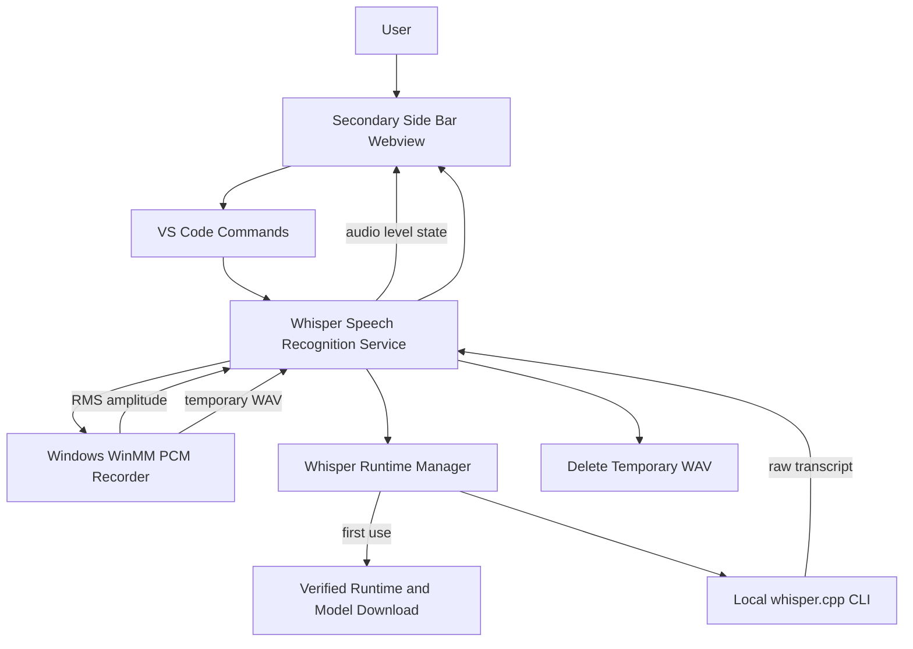
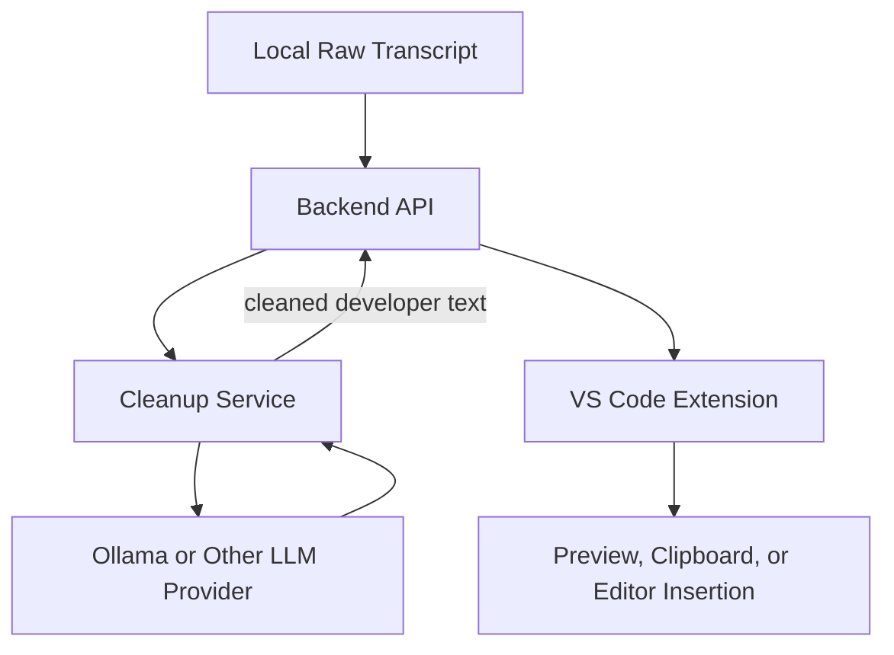

# Architecture

## Status

This document distinguishes the implemented raw voice-to-text slice from the
future speech-cleanup architecture.

Today, raw transcription runs locally in the extension environment. Backend
communication, editor insertion, AI cleanup, and Ollama integration have not
been implemented.

## Implemented Architecture



## Runtime Sequence

### Start Recording

1. The user opens the Voice Assistant view from the status bar or command palette.
2. The Start Recording command invokes `WhisperSpeechRecognitionService`.
3. `WhisperRuntimeManager` ensures the pinned runtime and `base.en` model exist.
4. Missing files are downloaded, checksum-verified, and stored in extension global storage.
5. A hidden PowerShell helper starts native WinMM PCM capture from the default microphone.
6. The helper writes PCM buffers to a temporary WAV and emits live RMS amplitude values.
7. The service forwards amplitude state to the webview, which animates the voice rings.

### Stop and Transcribe

1. The user presses the pause control, which invokes the Stop Recording command.
2. The recorder finalizes the WAV header and returns the recording path.
3. The extension launches the local `whisper.cpp` CLI with the `base.en` model.
4. Whisper writes the raw transcript to a temporary text file.
5. The extension reads the transcript and posts it to the webview.
6. Temporary audio and transcript files are deleted.

## Current Component Structure

```text
src/
├── commands/
│   └── registerCommands.ts
├── config/
│   ├── commandIds.ts
│   ├── viewIds.ts
│   └── whisperRuntime.ts
├── services/
│   ├── SpeechRecognitionState.ts
│   ├── WhisperRuntimeManager.ts
│   └── WhisperSpeechRecognitionService.ts
├── ui/
│   └── statusBar.ts
├── utils/
│   ├── downloadFile.ts
│   ├── fileHash.ts
│   └── nonce.ts
├── webview/
│   ├── VoiceAssistantViewProvider.ts
│   └── webviewContent.ts
└── extension.ts

resources/
├── microphone.svg
└── windowsAudioRecorder.ps1
```

## Component Responsibilities

### Extension Entry Point

`extension.ts` creates services, registers the Secondary Side Bar webview,
connects state updates, and adds disposables to the extension context.

### Commands

The command layer registers:

- Voice Assistant: Open Panel
- Voice Assistant: Start Recording
- Voice Assistant: Stop Recording

Commands coordinate the UI and speech service but contain no audio or
transcription implementation.

### Webview Layer

The webview is responsible for:

- Rendering status and raw transcript text
- Sending Start and Stop actions to the extension host
- Sending transcript reset actions to the extension host
- Sending copy-to-clipboard actions to the extension host
- Rendering microphone and pause states
- Animating concentric rings from normalized audio-level state

It does not access the microphone directly because VS Code webviews do not
provide reliable `getUserMedia` permission.

### Speech Recognition Service

`WhisperSpeechRecognitionService` owns the recording/transcription lifecycle:

- Start and Stop state transitions
- Native recorder process management
- RMS amplitude normalization and smoothing
- Whisper CLI process management
- Transcript loading
- Transcript accumulation and reset
- Temporary-file cleanup
- User-facing errors

### Runtime Manager

`WhisperRuntimeManager` owns local speech-runtime provisioning:

- Platform validation
- Runtime and model download
- Download progress reporting
- Checksum verification
- Archive extraction
- Stable global-storage paths

It currently supports Windows x64 only.

### Native Windows Recorder

`windowsAudioRecorder.ps1` compiles a small in-process C# WinMM host that:

- Captures 16 kHz, mono, 16-bit PCM from the default microphone
- Writes a valid WAV file
- Computes RMS amplitude from each captured PCM buffer
- Streams amplitude values to the extension over stdout
- Uses a small line-based process protocol

Protocol messages:

```text
READY
LEVEL:<rms-value>
COMPLETE:<base64-wav-path>
ERROR:<base64-error-message>
```

## Storage and Data Lifecycle

Persistent files in VS Code extension global storage:

- Pinned `whisper.cpp` runtime
- English `base.en` model

Ephemeral files:

- Recorded WAV
- Whisper transcript output

Ephemeral files are deleted after success or failure. Raw audio is never sent
over the network.

## Architectural Boundary

The extension remains thin with one deliberate exception: raw speech-to-text
runs locally to provide a private, backend-free recording experience.

The extension may:

- Capture microphone audio
- Compute UI-only audio levels
- Run local raw transcription
- Display raw transcripts
- Communicate with a future backend
- Insert future results into VS Code

The extension must not:

- Clean or rewrite transcripts
- Construct LLM prompts for cleanup
- Run Ollama or another cleanup LLM
- Know which cleanup model or provider the backend uses
- Store user prompts or transcripts permanently

## Future Cleanup Architecture



Ollama is a future backend provider, not an extension dependency. This keeps the
extension backend-agnostic and allows the cleanup implementation to change
without changing microphone capture or VS Code integration.

## Future API Contract

This contract is planned and is not implemented in the current slice.

Request:

```http
POST /api/voice/clean
Content-Type: application/json
```

```json
{
  "text": "uhh create like a route for users"
}
```

Response:

```json
{
  "text": "Create a GET /users route."
}
```

## Future Platform Providers

Cross-platform audio capture should use a common provider boundary:

```text
SpeechRecognitionService
├── Windows native PCM provider (implemented)
├── macOS native provider (planned)
└── Linux native provider (planned)
```

The UI and transcription state model should not depend on a specific native
audio implementation.

## Design Principles

- Keep command, UI, runtime, and native-audio responsibilities separate.
- Keep cleanup logic outside the extension.
- Prefer local processing for raw audio and explicit network boundaries.
- Verify downloaded executable and model assets before use.
- Delete temporary user audio as soon as processing finishes.
- Add abstractions only when they represent a real platform or service boundary.

## Current Non-Goals

- Backend communication
- AI cleanup
- Ollama integration
- Authentication and user accounts
- Database storage
- Settings UI
- Billing, analytics, or telemetry
- Audio upload
